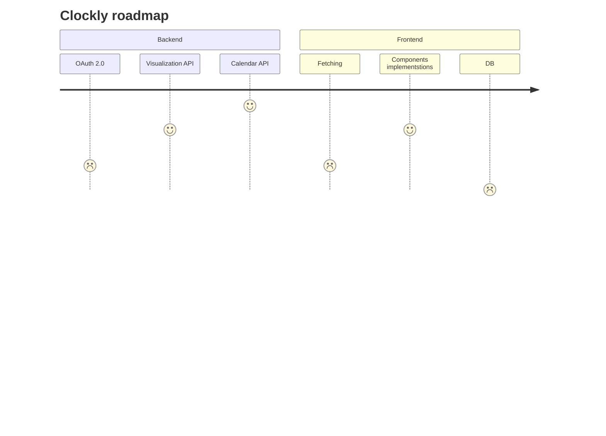

# Clockly

## Description

Clockly is a mobile calendar application. The project is designed to be an advanced alternative to Google Calendar, offering extended functionality such as custom summaries for selected timeframes, flexible configuration, and other additional features.

## Stack

<div style="display:flex; gap:10px; align-items:center;">
  
  
  
  
  
    
  
  
  
</div>

### Backend

- fastAPI
- Pydantic

### Frontend

- React Native
- Expo

## Structure

```text
📁.                                 project folder
 ├── 📁 backend                     server-side logic
 |    ├── 📁 auth                   authentication & authorization
 |    ├── 📁 DTOs                   data transfer objects
 |    ├── 📁 routers                api route definition
 |    ├── 📁 postgre                postgres setup via SQLAlchemy
 |    ├── 📁 services               logic layer
 |    ├── 📁 utils                  shared helper functions
 |    ├── 📝 main.py                backend entry point
 |    ├── ⚙️ .env.example           environment variables
 |    ├── 🐳 Containerfile          backend container build
 |    └── 📝 pyproject.toml         python dependencies & config
 ├── 📁 frontend                    client-side application
 |    ├── 📁 app                    application routing & pages
 |    ├── 📁 assets                 static files
 |    ├── 📁 components             reusable UI elements
 |    ├── 📁 constants              global constants & configurations
 |    ├── 📁 hooks                  custom state & lifecycle hooks
 |    ├── 📝 package.json           frontend dependencies & scripts
 |    └── 🐳 Containerfile          frontend container build
 ├── 🐳 compose.yaml                docker compose orchestration
 ├── 📄LICENCE                      LICENCE
 └── 📍README.md                    project description
```


## Usage

To run the application, follow these steps:

```bash
git clone https://github.com/cyjiky/Clockly.git

cd Clockly # Move to repository directory
```

### Using Docker Compose

**Run `compose.yaml`**

```bash
docker compose up
```

### How to use DB-UI?
-> TODO 

### Manually 
-> TODO (links)


## Features & Future Roadmap
-> TODO



---


## Project status

The project is currently under development

---

<div align="display:flex; gap:10px; align-items:center;">

**Authors**  
[@cyjiky](https://github.com/cyjiky) $\cdot$ [@yeghor](https://github.com/yeghor)

</div>
