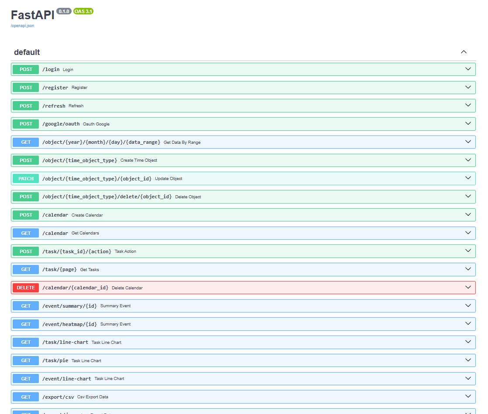

# Welcome to frontend 👋

> Requiring Python 3.11+, Poetry, Docker

This is backend side of the Clockly application.

Here you can find information of how setup and run the backend manually (not using Docker Compose).

Firstly, if you are in the project's root, move to the backend directory
```bash
cd backend 
```

# Get started

## Setup

Create `.env` based on the `.env.example` file:

```bash
copy .env.example .env
```

Fill it with your secrets and settings variables.

Install the dependencies:

```bash
pip install poetry # In case, you don't have poetry install 
poetry install
```

## Run

Firstly you need to run PostgreSQL docker container. Use this command:
```bash
docker run --name clockly_postgres_container -e POSTGRES_USER=database -e POSTGRES_PASSWORD=password -e POSTGRES_DB=prod -p 5432:5432 -d postgres
```

Make sure that the environment variables match the ones that you defined in `.env` file that you have created in previous steps.


Run the backend via `Uvicorn`:
```bash
uvicorn run main:app --host 127.0.0.1 --port 8000
```

## Access the backend

- Base URL: <http://127.0.0.1:8000>
- Swagger autogenerated API documentation: <http://127.0.0.1:8000/docs>

# Usage

You can test the application directly in Swagger docs. Works similarly to Postman.



Or send HTTP requests to `127.0.0.1:8000` via Postman or your web browser.

---

Good job!

Now, we suggest you looking to the frontend application [README.MD](https://github.com/cyjiky/Clockly/blob/main/frontend/README.md)